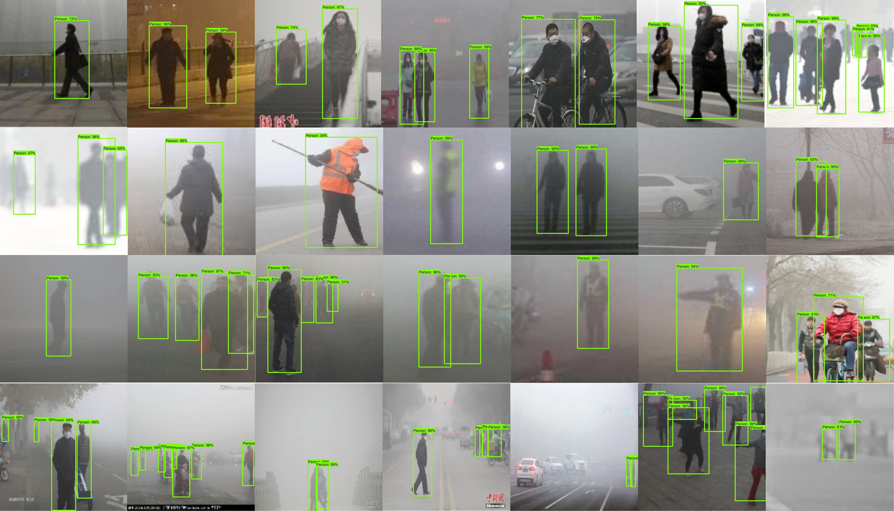
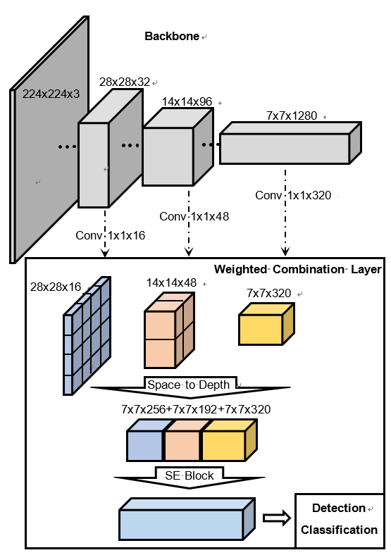

# Pedestrian detection in hazy weather
Traffic environments are constantly changing with fluctuating weather, driving, road, and pedestrian conditions. This flux is especially pronounced in China due to frequent haze that obstructs visibility on city roadways. As such, an efficient and accurate pedestrian detection algorithm for use during hazy weather is necessary.


## Approaches
We used mobilenet_v2 as backbone(Code also supports mobilenet_v1), and then proposed a layer called weighted combination to improve the performance of model. The weighted combination layer would combine feature maps from different convoutional layer, and then vis an attention module to recalibrating the feature map through learning weights in each channel(["Squeeze-and-Excitation Networks"](https://arxiv.org/pdf/1709.01507)) or both channel and spatial(["CBAM: Convolutional Block Attention Module"](https://arxiv.org/pdf/1807.06521.pdf)), following figure show the whole network architecture.
<div align=center></div>

## Evaluation
We used the average precision(AP) to evaluate our model, the AP for pedestrian would be calculated by using the mAP criterium defined in the [PASCAL VOC 2012 competition](http://host.robots.ox.ac.uk/pascal/VOC/voc2012/)., of which the tools were from [here](https://github.com/Cartucho/mAP). The following fugure show the PR curve of our model.
<div align=center></div>

## How to use code
### Training
Below script gives you an example of training a model with our models.
```
python train.py --model_name=prioriboxes_mbn --attention_module=se_block --batch_size=50 --learning_rate=1e-3 --f_log_step=20 --f_summary_step=20 --f_save_step=2000
```
Actually, our code supports multiple network configurations, below script show you some different network configurations.
```
--model_name = prioriboxes_mbn or prioriboxes_vgg
--attention_module = se_block or cbam_block or None

when --model_name == prioriboxes_mbn, we colud choose backbone and config the weighted combination layer.
--backbone_name = mobilenet_v2 or mobilener_v1
--multiscale_feats = True or False
```
